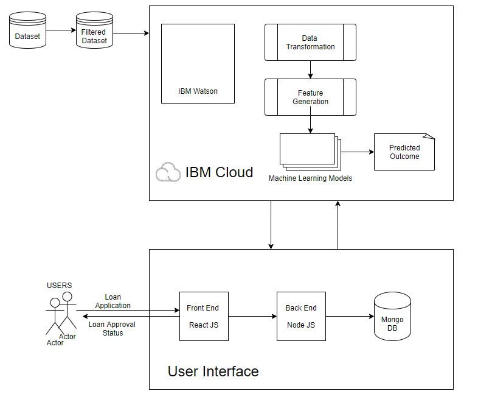

# Money-Lending Prediction Platform

### Project Title: 
Money-Lending Prediction Platform

### Project Idea Description:

  LendingClub is a US peer-to-peer lending company and the world's largest peer-to-peer lending platform. In this project, we build machine learning models to predict the probability that a loan on LendingClub will charge off (default). These models could help LendingClub investors make better-informed investment decisions. We use a 1.8 GB LendingClub dataset with 152 variables for each loan.
In training the models, we only use features that are known to investors before they choose to invest in the loan. These features include, among others, the borrower's income, FICO score, and debt-to-income ratio, and the loan amount, purpose, grade, and interest rate.
The modeling process takes several steps, including: removing loan features with significant missing data, or that aren't known to investors; exploring, transforming, and visualizing the data; creating dummy variables for categorical features; and fitting models: Decision tree, random forest, Support Vector Machine. We use cross validation to select the features which really influence a decision on the dataset.
All the analysis will be done in a Python Jupyter Notebook, utilizing the packages numpy, pandas, matplotlib, seaborn, and scikit-learn.

### Goal of the project:

  The goal of this project is to build a machine learning model to predict the probability that a loan will charge off. We will attempt to only use data available to investors via the LendingClub loan listing, including information about the borrower (income, employment length, FICO score, debt-to-income ratio, etc.) and the loan listing (the loan amount, loan purpose, loan grade, interest rate, installment, etc.). Such a predictive model could help LendingClub investors make better-informed investment decisions. We will only consider loans that LendingClub accepted under its credit underwriting policy.
  
### Technology stack:
Jupyter Notebook, IBM Watsaon, AWS JavaScript, Python, React, Redux, Node.JS, REST API, Mongo DB, Bootstrap, scikit-learn

### Architecture:

